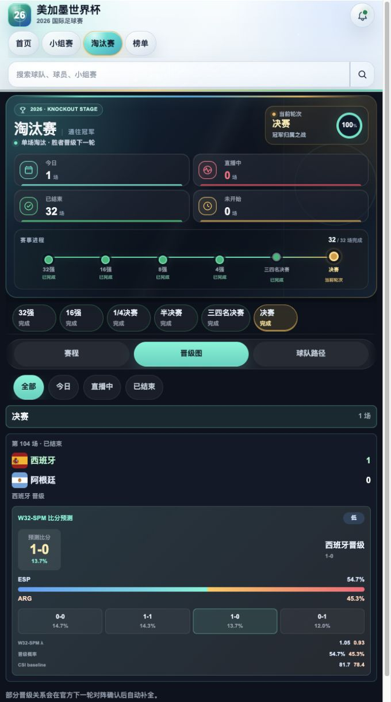
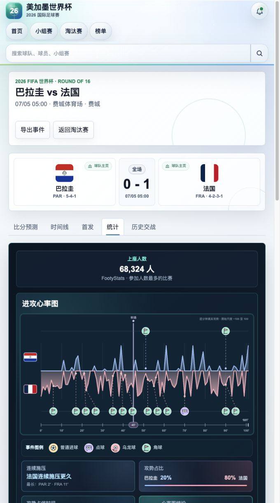
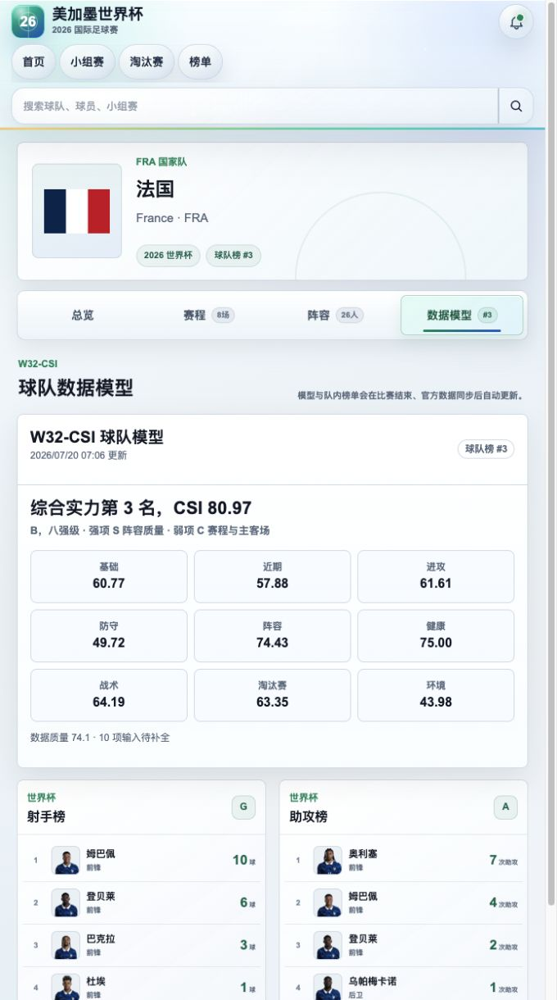
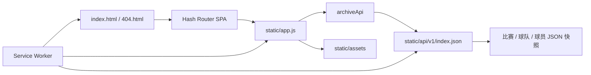

# 2026 美加墨世界杯数据档案

<p align="center">
  <strong>赛程、比分、球队、球员榜单、比赛统计与模型预测的交互式静态封存站</strong>
</p>

<p align="center">
  <a href="https://mike-hub1.github.io/"></a>
  <a href="https://worldcup-2026-archive.mike-hub1.workers.dev/"></a>
  
  
</p>

<p align="center">
  <a href="https://mike-hub1.github.io/"><b>访问 GitHub Pages 主站</b></a>
  &nbsp;·&nbsp;
  <a href="https://worldcup-2026-archive.mike-hub1.workers.dev/"><b>访问 Cloudflare 镜像</b></a>
</p>

<p align="center">
  <a href="https://mike-hub1.github.io/"></a>
</p>

## 项目简介

这是一个围绕 2026 美加墨世界杯构建的数据站点封存版。项目将赛事期间持续更新的赛程、赛果、球队与球员数据、比赛技术统计、历史交锋和预测模型输出，冻结为一套无需后端服务即可访问的静态快照。

站点保留原有单页应用的搜索、筛选、页面跳转、淘汰赛视图、球队路径、榜单切换和比赛详情等交互，但不会再请求实时接口、运行数据同步任务或修改封存数据。

## 数据快照

| 项目 | 封存规模 |
| --- | ---: |
| 比赛 | 104 场 |
| 球队 | 48 支 |
| 球员 | 1,247 名 |
| 本地 API 快照路径 | 1,846 条 |
| 数据停止更新 | 2026-07-20 10:00（北京时间） |
| 静态封存切换 | 2026-07-20 10:10（北京时间） |

以上数量来自封存包中的 `static/archive-mode.js`。静态包约 249 MB，数据与页面资源均随仓库分发。

## 页面预览

| 淘汰赛与 W32-SPM | 比赛技术统计 |
| --- | --- |
| <a href="https://mike-hub1.github.io/#/knockout?view=bracket&round=final"></a> | <a href="https://mike-hub1.github.io/#/matches/fifa_match_400021533?tab=stats"></a> |

| W32-CSI 球队模型 | 球员榜单 |
| --- | --- |
| <a href="https://mike-hub1.github.io/#/teams/fifa_team_43946?tab=model"></a> | <a href="https://mike-hub1.github.io/#/leaderboards/goals"></a> |

## 核心功能

| 模块 | 内容 |
| --- | --- |
| 首页 | 今日焦点、赛事入口、全站搜索和关键比赛展示 |
| 小组赛 | 分组积分、比赛日程、晋级状态与球队入口 |
| 淘汰赛 | 赛程、晋级图、左右半区、球队路径、状态筛选与下一轮关系 |
| 比赛中心 | 比分预测、时间线、首发阵容、技术统计、历史交锋与上座人数 |
| 榜单中心 | 射手榜、助攻榜、扑救榜、黄牌榜、红牌榜、身价榜和球队榜 |
| 球队页面 | 球队总览、完整赛程、阵容名单、队内榜单与数据模型 |
| 搜索 | 球队、球员、比赛和榜单内容的统一检索 |

## W32 模型

### W32-CSI 球队综合实力模型

W32-CSI 将球队表现归纳为可比较的综合评分。封存页面保留基础实力、近期状态、进攻、防守、阵容、健康、战术、淘汰赛表现和环境等模块分值，同时展示综合排名、数据质量和待补全输入数量。

模型结果用于站内球队榜和比赛预测的 baseline。它是数据分析输出，不代表官方排名，也不构成投注建议。

### W32-SPM 单场预测模型

W32-SPM 以 W32-CSI 为基础，结合单场进攻与防守强度、比赛阶段及比分分布，使用 Poisson / Dixon-Coles 思路生成：

- 90 分钟比分概率分布
- 双方晋级概率
- 最可能比分与模型倾向
- 模型置信度及关键输入摘要

预测结果按赛前版本封存；官方赛果确认后仍保留赛前判断，便于回看模型与真实结果之间的差异。

## 数据来源

站点在赛事更新阶段采用多来源交叉整理，封存版保留当时已确认的数据和来源标记：

| 来源 | 主要用途 |
| --- | --- |
| FIFA 公开赛事数据 | 赛程、比分、球队、球员、场馆与比赛事件主数据 |
| ESPN | 技术统计、比赛事件和助攻等字段的交叉核对与补充 |
| Transfermarkt | 球员身价与阵容信息补充 |
| 球天下（QTX） | FIFA 数据范围外的历史交锋补充 |
| FootyStats | 比赛上座人数补充与核对 |

发生来源差异时，项目优先采用官方赛事数据，并在具体页面保留来源或口径提示。第三方数据可能因统计口径不同而存在差异。

## 静态封存架构



封存模式由 `static/archive-mode.js` 开启。应用中的 GET 请求由 `archiveApi` 映射到仓库内的 JSON 文件，因此页面不依赖远程数据库、运行中的 Python 服务或第三方实时 API。

## 仓库结构

```text
.
├── index.html                 # GitHub Pages 入口
├── 404.html                   # SPA 路由回退
├── sw.js                      # 静态缓存与离线支持
├── .nojekyll                  # 禁用 Jekyll 处理
├── readme-*.png               # README 页面截图
└── static/
    ├── app.js                 # 页面渲染与交互逻辑
    ├── styles.css             # 全站样式
    ├── archive-mode.js        # 封存配置与快照信息
    ├── api/v1/                # 本地 API JSON 快照
    └── assets/                # 国旗、球员、球队及赛事图片资源
```

## 本地预览

项目不需要构建步骤。克隆后在仓库根目录启动任意静态文件服务器即可：

```bash
git clone https://github.com/Mike-hub1/Mike-hub1.github.io.git
cd Mike-hub1.github.io
python3 -m http.server 8080
```

随后访问 `http://localhost:8080/`。

不要直接双击 `index.html` 预览；浏览器对 `file://` 下的 JSON 请求和 Service Worker 有安全限制。

## 部署

本仓库已经按 GitHub Pages 的根目录部署方式组织：

1. 默认分支为 `main`。
2. Pages 发布源为 `main / (root)`。
3. 推送静态文件后，GitHub Pages 自动生成新部署。
4. 路由使用 `#/...`，刷新深层页面时不需要服务器重写规则。

同一份封存包也部署在 Cloudflare Workers Static Assets，作为独立镜像地址。两个站点共享相同的数据快照，不再执行实时同步。

## 封存原则

- 不再调用实时比赛 API
- 不再运行自动更新、健康检查或自修复写入任务
- 不再依赖本机登录项、LaunchAgent 或常驻 Python 进程
- 保留搜索、筛选、榜单、模型和页面导航等前端交互
- 数据与资源固定在仓库中，可被再次部署或离线保存

## 说明

本项目为独立的数据整理与可视化档案，与 FIFA、ESPN、Transfermarkt、球天下或 FootyStats 不存在官方隶属或合作关系。赛事名称、队徽、球员肖像及第三方数据的相关权利归各自权利人所有。

模型输出仅用于赛事回顾与数据研究，不应作为博彩、投资或其他高风险决策依据。
